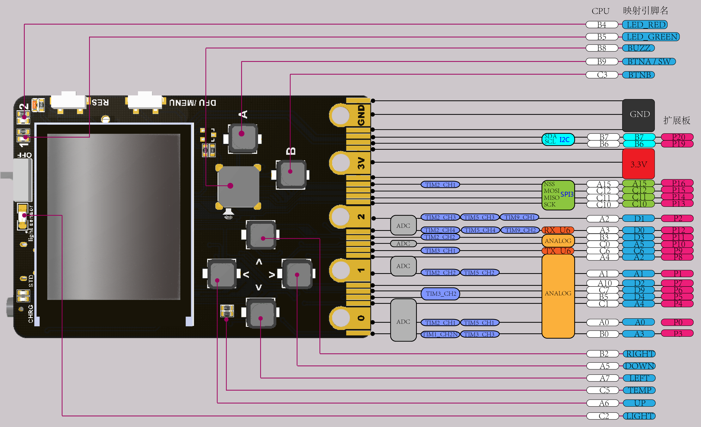

# Meowbit

- [Meowbit](#meowbit)
  - [Spezifikation](#spezifikation)
  - [Pinbelegung](#pinbelegung)
  - [Entwicklungsumgebungen](#entwicklungsumgebungen)
    - [Microsoft MakeCode Arcade](#microsoft-makecode-arcade)
    - [Kittenblock](#kittenblock)
    - [Mu-Editor](#mu-editor)
  - [Dokumentation](#dokumentation)
  - [Python mit Kittenblock](#python-mit-kittenblock)
    - [Bildschirm und Tasten](#bildschirm-und-tasten)
    - [01 Erster Test: 01 Blinkende LED](#01-erster-test-01-blinkende-led)
    - [02 Befehle für Leuchtdioden (LEDs)](#02-befehle-f%c3%bcr-leuchtdioden-leds)
    - [03 Atmende LED](#03-atmende-led)
    - [04 Tasten per Interrupt](#04-tasten-per-interrupt)
    - [05 Töne & Melodien](#05-t%c3%b6ne--melodien)
    - [08 Bildschirm](#08-bildschirm)
    - [Kurzdokumentation](#kurzdokumentation)
    - [Grundlagen](#grundlagen)
    - [MicroPython Kurzbeispiele](#micropython-kurzbeispiele)
      - [Universelle Tastenabfrage](#universelle-tastenabfrage)
      - [Timing (Zeitverhalten steuern)](#timing-zeitverhalten-steuern)
      - [LED steuern](#led-steuern)
      - [Allzweckeingabe/-ausgabe (engl. GPIO – general purpose input/output) steuern](#allzweckeingabe-ausgabe-engl-gpio-%e2%80%93-general-purpose-inputoutput-steuern)
      - [Konfigurieren von I/0 Ausgaben um auf externe Ereignisse zu reagieren](#konfigurieren-von-i0-ausgaben-um-auf-externe-ereignisse-zu-reagieren)
      - [Zeitsteuerung-Timer](#zeitsteuerung-timer)
      - [Pulsweitenmodulation (PWM)](#pulsweitenmodulation-pwm)
      - [Analog-Digital-Wandler](#analog-digital-wandler)
      - [Verwendung UART-Schnittstelle](#verwendung-uart-schnittstelle)
      - [I2C-Ansteuerung](#i2c-ansteuerung)
      - [Verwendung des Serial Peripheral Interface (SPI)](#verwendung-des-serial-peripheral-interface-spi)
      - [Framebuffer](#framebuffer)
    - [Fortgeschritten](#fortgeschritten)
      - [Zeige mehrere Sprachen](#zeige-mehrere-sprachen)
      - [Kreiselwert anzeigen](#kreiselwert-anzeigen)
  - [CircuitPython](#circuitpython)

Infos und Beispiele zum Meowbit von <https://kittenbot.cn>.

Das
[Meowbit](https://www.kittenbot.cc/collections/frontpage/products/meowbit-codable-console-for-microsoft-makecode-arcade)
ist eine kleine Spielekonsole des chinesischen Herstellers Kittenbot. Du
kannst es [auf Amazon kaufen](https://amzn.to/2R8b7Ja). Auch Adafruit
[vertreibt
es](https://blog.adafruit.com/2019/08/01/new-product-kittenbot-meowbit-codable-console-for-makecode-arcade/)
seit August 2019. 

## Spezifikation

Das Meowbit nutzt als Rechenkern einen `STM32F401RET6`, das ist ein
32-Bit-ARM-Cortex-M4-Prozessor
([Datenblatt](http://www.farnell.com/datasheets/1848998.pdf)). Darüber hinaus
ist eine beeindruckende Menge an Hardware eingebaut:

- LED für Lade- / Arbeitsanzeige
- Lichtsensor
- Schiebeschalter zum Ein-/Ausschalten
- zwei programmierbare LED
- Reset-Taste
- DFU-Modus-Taste (auch zum Aufrufen des Menüs durch die Makecode-Firmware)
- 160 x 128 TFT Farbbildschirm (ST7735)
- Temperaturfühler
- vier programmierbare Richtungstasten
- programmierbarer Summer
- zwei programmierbare Tasten A und B
- 40-Pin-Goldkontaktleiste, kompatibel zum micro:bit
- USB-Port zum Laden und Programmieren
- SD-Kartenslot (zum Speichern von Programmen und nachträglichen Erweitern um ein Bluetooth- oder WLAN-Modul)
- Klinkenbuchse zum Verbinden mehrerer Geräte (JacDac)
- 6-Achsen-Gyroskop und Beschleunigungsmesser (InvenSense MPU-6050)
- 3,7 V Lithium-Batterie-Schnittstelle

Standardmäßig sind 2 MByte des SPI-Flash-Speichers mit einer Unicode-Zeichentabelle
belegt.

## Pinbelegung

Hier ist die Pinbelegung der 40-poligen Steckerleiste (Stand: 2020-01-18.
[Original](https://meowbit-doc.kittenbot.cn/#/more/intro)):



## Entwicklungsumgebungen

Das Meowbit kann auf drei Arten programmiert werden:

### Microsoft MakeCode Arcade

<https://arcade.makecode.com/> von Microsoft. Das Meowbit ist eine der
offiziell unterstützten Spielekonsolen.


### Kittenblock

Kittenblock ist eine Eigenentwicklung von Kittenbot. Basiert in Teilen auf
Scratch 3.0. Ist für Windows und Mac verfügbar:
<https://www.kittenbot.cc/pages/software>

### Mu-Editor

Ein von Kittenbot speziell für den Meowbit angepassten **Mu-Editor**. Ist
allerdings nur für Windows verfügbar:
<https://www.kittenbot.cc/pages/software>

Es kann allerdings eine Variante bspw. für Linux aus den Quellen von
Kittenbot erstellt werden:

```shell
git clone https://gitee.com/Kittenbot/mu-kittenbot.git
cd mu-kittenbot
pip3 install -e ".[dev]"
python3 run.py
```

## Dokumentation

Das Meowbit ist eigentlich [sehr gut
dokumentiert](https://meowbit-doc.kittenbot.cn/#/kittenblock/kittenblockQS),
leider allerdings nur in Chinesisch. Hier hilft der Chrome-Browser mit seiner
automatischen Übersetzungsfunktion.


## Python mit Kittenblock

Um die Hardware des Meowbit in MicroPython nutzen zu können, müssen einige
Bibliotheken auf das PYBFLASH-Laufwerk gezogen werden. Diese befinden sich in
dem Scratch 3.0 Extensions Repositorie und können dort heruntergeladen
werden: <https://github.com/KittenBot/s3ext-meowbit>.

- `buzz.py` - für den Summer
- `mpu6050.py` - für das sechsachsige Gyroskop
- `tft.py` - für den Farbbildschirm
- `turtle.py` - für Zeichnungen mit Turtle-Grafik

### Bildschirm und Tasten

Der Bildschirm hat eine Auflösung von 160 (horizontal) und 128 (vertikal).
Der Ursprung (Punkt 0,0) ist oben links. Die Bildschirmmitte liegt demnach
bei (80, 64).

Der Code für die folgenden Beispiele liegt im [code/](code/)-Unterverzeichnis.

### 01 Erster Test: 01 Blinkende LED

Hier ist ein erstes Programm zum Blinken der LED


### 02 Befehle für Leuchtdioden (LEDs)

Dies sind die Befehle für die eine, grüne LED am Gerät oben rechts:

- `led1.on()` # LED an
- `led1.off()` # LED aus
- `led1.toggle()` # LED umschalten
- `led1.intensity(x)` # Helligkeit der LED

Hier ein weiteres Beispiel:


### 03 Atmende LED

Wie die Statusleuchte an Macs:


### 04 Tasten per Interrupt

Für gute Responsivität können die Tasten per Interrupt abgefragt werden.
Einen passenden, blauen Block habe ich nicht gefunden (obwohl er in der
[Originaldokumentation](https://meowbit-doc.kittenbot.cn/#/kittenblock/02%E6%8C%89%E9%94%AE%E6%A3%80%E6%B5%8B)
abgebildet ist), aber [hier](code/04-keys.py) ist der Python-Code.

Ich habe in der Anleitung ein [komplexeres
Beispiel](code/05-keys-intensity.sb3) inklusive der Blöcke gefunden:


Die komplette Dokumentation zum Abfragen der Tasten liegt
[hier](https://meowbit-doc.kittenbot.cn/#/micropython/reference/%E9%80%9A%E7%94%A8%E6%8C%89%E9%94%AE).

### 05 Töne & Melodien

Für Töne gibt es zwei Blöcke:


Der erste Block kann einen Ton einer bestimmten Tonhöhe erzeugen. Mit dem
zweitren Block lassen sich ganze Melodien abspielen. Die Melodie im Beispiel
besteht aus 5 Noten.

Das folgende Beispiel nutzt die Fähigkeit von Scratch 3, Listen zu verwalten,
um darin eine Melodie zu speichern:


Hier sind die Listen auf der Bühne:


[Hier](code/07-zwei-tiger.py) ist der erzeugte Python-Code.

Das Lied wird in drei Listen verwaltet:

- `note` enthält eine Tonleiter
- `song` speichert die Noten des Liedes als Index der Tonleiter (von 1 an gezählt)
- `beat` gibt für jede Note die Länge in Millisekunden

Die Dokumentation der Musikfunktionen liegt
[hier](https://meowbit-doc.kittenbot.cn/#/micropython/%E8%9C%82%E9%B8%A3%E5%99%A8).

### 08 Bildschirm

Hier sind die Blocke zur Anzeige auf dem Bildschirm:


Dies sind die Python-Funktionen dazu:

```python
import pyb
import framebuf

tft = pyb.SCREEN()
fbuf = bytearray(160*128*2)
fb = framebuf.FrameBuffer(fbuf, 160, 128, framebuf.RGB565)

# Fülle den Bildschirm mit einer Farbe (Hex-Code)
fb.fill(color)

# Zeige einen Bildpunkt bei X und Y kn einer bestimmten Farbe (ein Hex-Wert)
fb.pixel(x, y, color)

# Zeichne eine Linie zwischen dem Startpunkt x1,y1 und x2,y2 in einer
# bestimmten Farbe (Hex-Code)
fb.line(x1, y1, x2, y2, color)

# Zeichne ein Rechteck von der Ecke x,y mit Breite w, Höhe h und Farbe color
# (Hex-Code)
fb.rect(x, y, w, h, color)

# Schreibe den Text "content" ab x,y mit Farbe color
fb.text("content", x, y, color)

# Frische den Bildschirminhalt auf
tft.show(fb)
````

Hier ist ein kleines ["Hallo Welt"-Programm](code/08-hello.py):


Jetzt noch ein größeres Programm:

Das ist das Ergebnis:


Die komplette Dokumentation der Framebuffer-Klasse findet sich
[hier](https://meowbit-doc.kittenbot.cn/#/micropython/reference/%E9%80%90%E5%B8%A7%E7%BC%93%E5%86%B2).
Hier ist eine Zusammenfassung:

- Klasse FrameBuffer (Puffer, Breite, Höhe, Höhe, Format, Schrittweite = Breite)

Methoden auf der FrameBuffer-Klasse:

- fill (Farbe)
- pixel (x, y, Farbe)
- hline (x, y, w, c)
- vline (x, y, h, c)
- line (x1, y1, x2, y2, c)
- rect (x, y, b, h, c)
- fill_rect (x, y, w, h, c)
- text (s, x, y, c)
- loadbmp ('x')
- loadgif ('x', f)
- scroll (xstep, ystep)
- blit (fbuf, x, y, key)

### Kurzdokumentation

Ich habe oben bereits einige Einstiegspunkte in die
[Kurzdokumentation](https://meowbit-doc.kittenbot.cn/#/micropython/micropython%E5%BF%AB%E9%80%9F%E5%BC%80%E5%A7%8B)
für die Pythonprogrammierung des Meowbits genannt. Diese Links führen auf
eine chinesische Seite. Es gibt die Dokumentation des Meowbits leider im
Augenblick nur so. Die chinesischen Seiten lassen sich allerdings ganz
ordentlich über die Übersetzungsfunkton des Chrome-Browsers übersetzen. Hier
sind die Abschnitte:

- Grundlagen
- Kurzbeispiele
- Fortgeschritten

### Grundlagen

- [Schnellstart](https://meowbit-doc.kittenbot.cn/#/micropython/micropython%E5%BF%AB%E9%80%9F%E5%BC%80%E5%A7%8B)
- [LED](https://meowbit-doc.kittenbot.cn/#/micropython/%E5%8F%AF%E7%BC%96%E7%A8%8BLED)
- [Farbdisplay](https://meowbit-doc.kittenbot.cn/#/micropython/%E5%BD%A9%E5%B1%8F%E6%98%BE%E7%A4%BA)
- [Summer](https://meowbit-doc.kittenbot.cn/#/micropython/%E8%9C%82%E9%B8%A3%E5%99%A8)
- [Tastenerkennung](https://meowbit-doc.kittenbot.cn/#/micropython/%E6%8C%89%E9%94%AE%E6%A3%80%E6%B5%8B)
- [Temperatur- / Lichtsensor](https://meowbit-doc.kittenbot.cn/#/micropython/%E6%B8%A9%E5%BA%A6%E5%92%8C%E5%85%89%E7%BA%BF%E4%BC%A0%E6%84%9F%E5%99%A8)
- [Gyroskop](https://meowbit-doc.kittenbot.cn/#/micropython/%E9%99%80%E8%9E%BA%E4%BB%AA)

### MicroPython Kurzbeispiele

#### Universelle Tastenabfrage

```python
from pyb import Pin    #引入引脚类
from pyb import ExtInt #引入中断类

btnA = Pin('BTNA', Pin.IN, Pin.PULL_UP) #以实例化按键A为例子
btnA.value()                            #读按键A的返回值

def callback(line):
        print("up", line)      #定义回调函数

# 可用按键有："up","down","left","right","A","B"

ext = ExtInt(Pin('UP'),ExtInt.IRQ_FALLING, Pin.PULL_UP, callback)   #定义中断
```

#### Timing (Zeitverhalten steuern)

```python
import time     #导入time模块

time.sleep(1)       #延时1秒
time.sleep_ms(500)  #延时500毫秒
time.sleep_us(10)   #延时10微妙

start = time.ticks_ms()     #获取当前毫秒计数器数值
time.sleep_ms(1000)         #
interval = time.ticks_diff(time.tick_ms(), start)   #计算时间差(现在时间， 开始时间)
```

#### LED steuern

```python
from pyb import LED

led = LED(1)  #两颗LED从左到右分别为LED（1），LED（2）

led.toggle()  #LED翻转
led.on()      #打开LED
led.off()     #关闭LED
led.intensity([value])  #获取或设置led的亮度(0~255)
```

- <https://docs.micropython.org/en/latest/library/pyb.LED.html>

#### Allzweckeingabe/-ausgabe (engl. GPIO – general purpose input/output) steuern

```python
from pyb import Pin  #引入引脚类

help(Pin.board)  #在MU中使用REPL敲如下指令查看喵比特所有引脚定义

p_out = Pin('A1', Pin.OUT_PP)       #将A2设置为推挽式驱动输出模式
p_out.high()        #引脚输出高电平
p_out.low()         #引脚输出低电平

p_in = Pin('A2', Pin.IN, Pin.PULL_UP)  #将A2设置为输入模式，且设置上拉
p_in.value()      #获取I0的电平，0或者1
```

- <https://docs.micropython.org/en/latest/library/machine.Pin.html>

#### Konfigurieren von I/0 Ausgaben um auf externe Ereignisse zu reagieren

Stichworte: Externe Interrupts / Hardwareinterrupts

```python
from pyb import Pin, ExtInt

callback = lambda e: print("interrupt")  类似回调函数的匿名函数

ext = ExtInt(Pin('A1'), ExtInt.IRQ_RISING, Pin.PULL_NONE, callback) #（引脚，触发方式，上下拉，反应函数）
```

- <https://docs.micropython.org/en/latest/library/pyb.ExtInt.html>

#### Zeitsteuerung-Timer

```shell
from pyb import Timer
from pyb import LED

tim = Timer(1, freq = 1000) #实例化一个timer对象，使用定时器4、设置频率为1000hz
tim.counter()   #查看计数值

tim = Timer(1)                           #实例化一个timer对象，使用定时器1
tim.init(freq = 1)                       #初始化设置触发频率为1HZ
tim.init(prescaler = 83, period = 999)   #初始化设置预分频器和定时器周期

tim.callback(lambda t: LED(1).toggle())  #通过回调方法，调用python函数
```

- <http://docs.micropython.org/en/latest/library/pyb.Timer.html>

#### Pulsweitenmodulation (PWM)

Modulationsart, bei der eine technische Größe (z. B. elektrischer Strom)
zwischen zwei Werten wechselt.

```python
from pyb import Pin， Timer

p = Pin（'B8'）  #PB8所属 TIM4_CH3
tim = Timer(4， freq = 1000)

ch = tim.channel(3， Timer.PWM， pin = p)  #（通道，模式， 引脚对象）
ch.pulse_width_percent(50)                #使用的初始脉宽值百分比
```

- <http://docs.micropython.org/en/latest/library/pyb.Timer.html>

#### Analog-Digital-Wandler

Ein Analog-Digital-Umsetzer ist ein elektronisches Gerät, Bauelement oder
Teil eines Bauelements zur Umsetzung analoger Eingangssignale in einen
digitalen Datenstrom, der dann weiterverarbeitet oder gespeichert werden
kann. Weitere Namen und Abkürzungen sind ADU, Analog-Digital-Wandler oder
A/D-Wandler, englisch ADC (analog-to-digital converter) oder kurz A/D.

Siehe auch: <https://de.wikipedia.org/wiki/Analog-Digital-Umsetzer>

```python
from pyb import Pin, ADC

adc = ADC(Pin('A0'))    #A0具有ADC功能 (ADC1_IN0)
adc.read()              #读取值，0~4095
```

- <http://docs.micropython.org/en/latest/library/pyb.ADC.html>

#### Verwendung UART-Schnittstelle

Nach `I2C` und `SPI` ist `UART` das am dritthäufigsten verwendete serielle
"Bus"-Protokoll.

Eine UART-Schnittstelle dient zum Senden und Empfangen von Daten über eine
Datenleitung und bildet den Standard der seriellen Schnittstellen an PCs und
Mikrocontrollern. Diese kommunizieren über eine nicht geteilte Sende- (TX)
und Empfangsleitung (RX) mit fester Baudrate.

Im industriellen Bereich ist die Schnittstelle mit
verschiedenen Interfaces (z.B. RS-232 oder EIA-485) sehr verbreitet. Die am
häufigsten verwendeten Geräte, die UART verwenden, sind Drucker, GPS-Module,
MIDI-Schnittstellen, Fingerabdrucksensoren und eine Reihe von
Sensoren.

Siehe auch: <https://www.hsg-kl.de/faecher/inf/netze/material/bitfuerbit.html>

```shell
from pyb import UART

uart = UART(6, 9600)   #使用USART6

uart.write('hello')
uart.read(5)  #最多读取5个字节
```

- <http://docs.micropython.org/en/latest/library/pyb.UART.html>

#### I2C-Ansteuerung

Das I2C-Protokoll (I2C = Inter-Integrated Circuit) ist ein Beispiel für ein
serielles Protokoll, mit dem Geräte miteinander kommunizieren können. I2C ist
ein serielles Protokoll, weil es eine Taktleitung und eine einzige
Datenleitung hat, welche sowohl für das Senden als auch für das Empfangen von
Daten verwendet wird.

`SCL` (Serial Clock) transportiert das Taktsignal. Dieses wird ausschließlich
vom Busmaster erzeugt und von den angeschlossenen Chips gelesen, die
Übertragungsrichtung ist daher eindeutig festgelegt.

`SDA` (Serial Data) überträgt die Datenbits. Über diesen Anschluss senden
sowohl Master als auch Slave ihre Daten.

Verwendbar für unteranderem:

- Temperatur Sensor

```python
from pyb import I2C

i2c = I2C(1)
```

- <http://docs.micropython.org/en/latest/library/pyb.I2C.html>

#### Verwendung des Serial Peripheral Interface (SPI)

Das SPI-Protokoll oder die serielle Peripherieschnittstelle ist ein weiteres
Beispiel für ein serielles Protokoll für zwei Geräte zum Senden und Empfangen
von Daten. Der große Unterschied zwischen SPI und I2C besteht darin, dass SPI
ein mehr Drähte verwendet. Insbesondere eine explizite Dateneingangs- und
Datenausleitung, anstatt wie bei I2C eine einzige Datenleitung zu verwenden.
Es gibt auch eine Taktleitung wie bei I2C, aber SPI bietet den Vorteil,
beliebige Taktfrequenzen von ein paar Kilohertz bis zu Hunderten von
Megahertz zu verwenden (wenn die Hardware dies unterstützt!). Dadurch eignet
sich das SPI-Protokoll hervorragend für Geräte wie TFT-Displays, die sehr
große Datenmengen senden müssen - mit der Kontrolle über die Taktfrequenz ist
es möglich, sehr schnell ganze Bildschirmbilder an das Display zu senden.

Verwendbar für unteranderem:

- TFT-Display
- Temperatur Sensor
- Barometer Sensor (zur Messung des Luftdrucks)
- 7-Segment-Anzeige
- Potentiometer

```python
from pyb import SPI

spi = SPI(1)  #创建一个SPI对象，如果没有没有附加参数，则SP1对象创建但未初始化

SPI.init(SPI.MASTER, baudrate = 600000, polarity = 1, crc = 0x7) #(mode, baudrate=328125, *, prescaler, polarity=1, phase=0, bits=8, firstbit=SPI.MSB, ti=False, crc=None)

data = spi.send_recv(b'1234') #发送4个字节和接收4个字节
buf = bytearray(4)
spi.send_recv(b'1234', buf)   #发送4个字节和接收4个字节存储到buf
```

- <https://docs.micropython.org/en/latest/library/pyb.SPI.html>

#### Framebuffer

### Fortgeschritten

#### Zeige mehrere Sprachen

#### Kreiselwert anzeigen

## CircuitPython

Der Meowbit kann mittels CircuitPython programmiert werden:
<https://circuitpython.org/board/meowbit_v121/>